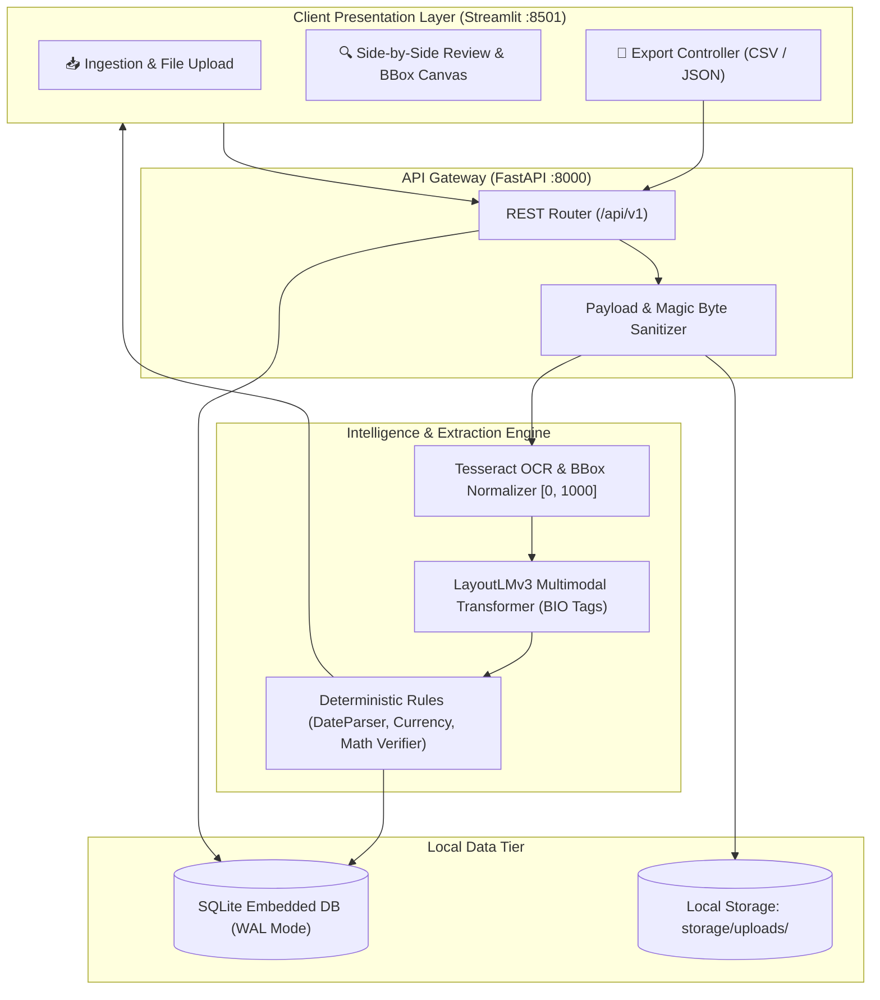

# 📄 DocuParse AI

> **Intelligent, Privacy-First Financial Document Extraction Powered by Multimodal Deep Learning (LayoutLMv3) and Deterministic Verification.**

[](https://fastapi.tiangolo.com)
[](https://streamlit.io)
[](https://huggingface.co/microsoft/layoutlmv3-base)
[](https://sqlite.org)
[](https://docker.com)
[](LICENSE)

---

## 🚀 Overview

DocuParse AI is an end-to-end, local-first document intelligence platform engineered to parse semi-structured financial documents (invoices, receipts, and purchase orders) into structured, validated data.

By combining **Tesseract OCR spatial token extraction** with Microsoft's multimodal **LayoutLMv3** transformer and a deterministic validation layer (Date normalization, currency parsing, arithmetic consistency checks: `Subtotal + Tax = Total`), DocuParse AI replaces error-prone manual data entry with a rapid, human-in-the-loop review workflow.

---

## 🏗 System Architecture



---

## ✨ Key Features

- **🛡 100% Local & Confidential:** Zero external cloud APIs, zero per-page fees. All images, models, and databases remain strictly on your local machine.
- **🧠 Multimodal Deep Learning:** Ingests raw pixels, textual tokens, and 2D spatial coordinates via `microsoft/layoutlmv3-base` to understand spatial layout context.
- **⚖️ Deterministic Business Guardrails:** 
  - Standardizes dates to ISO 8601 (`YYYY-MM-DD`).
  - Cleans currency strings and auto-corrects common OCR misreads (`O` $\rightarrow$ `0`).
  - Verifies arithmetic parity: $|\text{Total} - (\text{Subtotal} + \text{Tax})| \le 0.05$.
- **🎨 Interactive Side-by-Side Workspace:** Streamlit dark-mode UI with color-coded bounding box overlays, confidence badges (Green $\ge 85\%$, Amber $60-84\%$, Red $< 60\%$), and inline correction fields.
- **⚡ High-Concurrency Storage:** SQLite configured with Write-Ahead Logging (`PRAGMA journal_mode = WAL;`) for non-blocking concurrent reads and writes.
- **📦 Instant Financial Exports:** Download validated records directly as standard CSV or structured JSON.

---

## 🛠 Tech Stack

| Layer | Technologies |
| :--- | :--- |
| **Backend API** | FastAPI, Uvicorn, Pydantic v2 |
| **Frontend UI** | Streamlit, Custom CSS Injection, Pillow, OpenCV |
| **ML & Vision** | PyTorch, Hugging Face Transformers (`LayoutLMv3`), PyTesseract |
| **Database** | SQLite 3 (WAL Mode), SQLAlchemy ORM |
| **Containerization**| Multi-stage Dockerfile, Docker Compose |
| **Testing** | Pytest, HTTPX (FastAPI TestClient) |

---

## ⚡ Quickstart

### Option A: Local Development (Windows / Linux / macOS)

1. **Clone & Setup Virtual Environment:**
   ```bash
   git clone https://github.com/HarshkumarG007/DocuParseAi.git
   cd DocuParseAi
   
   python -m venv venv
   # On Windows (PowerShell):
   .\venv\Scripts\Activate.ps1
   # On Linux/macOS:
   source venv/bin/activate
   ```

2. **Install Dependencies:**
   ```bash
   pip install -r requirements.txt
   pip install -r requirements-dev.txt
   ```

3. **Verify Environment (Pre-flight Check):**
   ```bash
   python scripts/diagnostics.py
   ```

4. **Launch Application:**
   ```bash
   python scripts/run_dev.py
   ```
   - **Frontend UI:** Open [http://localhost:8501](http://localhost:8501)
   - **API Swagger Docs:** Open [http://localhost:8000/docs](http://localhost:8000/docs)

5. **Generate a Sample Receipt for Testing:**
   ```bash
   python scripts/generate_sample_receipt.py
   ```
   Upload the generated `sample_receipt.jpg` in the web workspace!

---

### Option B: Docker Compose (Fully Isolated)

Runs the entire stack in an isolated Debian container with Tesseract C++ libraries pre-installed:

```bash
docker-compose up --build
```
Access the UI at `http://localhost:8501` and backend API at `http://localhost:8000`.

---

## 📡 REST API Reference

All endpoints are versioned under `/api/v1`:

| Method | Endpoint | Description | Request Payload | Response |
| :--- | :--- | :--- | :--- | :--- |
| `POST` | `/api/v1/documents/upload` | Ingest and parse document | `multipart/form-data` (`file`) | `DocumentResponse` JSON |
| `GET` | `/api/v1/documents` | List all processed documents | Query: `?skip=0&limit=100` | `List[DocumentResponse]` |
| `GET` | `/api/v1/documents/{id}` | Retrieve document details & extractions | Path param: `id` | `DocumentResponse` |
| `POST` | `/api/v1/documents/{id}/correct` | Save human operator corrections | JSON: `{field_type, original_value, corrected_value}` | `{"status": "success"}` |
| `GET` | `/api/v1/documents/{id}/export` | Export verified data | Query: `?format=csv` or `?format=json` | File stream (CSV or JSON) |

### Sample Extracted Payload (`GET /api/v1/documents/{id}`)
```json
{
  "id": "doc_fb26aefe6e6c4126825eb4baf21e366b",
  "original_filename": "sample_receipt.jpg",
  "status": "PROCESSED",
  "overall_confidence": 0.85,
  "has_validation_error": false,
  "extractions": [
    {
      "field_type": "vendor",
      "raw_text": "ACME CAFE & ROASTERY",
      "normalized_text": "ACME CAFE & ROASTERY",
      "confidence": 0.85,
      "bbox_json": "[10, 20, 150, 60]",
      "is_validated": true
    },
    {
      "field_type": "date",
      "raw_text": "2024-05-15",
      "normalized_text": "2024-05-15",
      "confidence": 0.85,
      "bbox_json": "[10, 70, 120, 90]",
      "is_validated": true
    },
    {
      "field_type": "total",
      "raw_text": "$51.98",
      "normalized_text": "51.98",
      "confidence": 0.85,
      "bbox_json": "[10, 180, 130, 210]",
      "is_validated": true,
      "validation_notes": "Math verified: 49.5 + 2.48 = 51.98"
    }
  ]
}
```

---

## 🧪 Running Automated Tests

Run the full automated test suite (18 unit and integration tests across rules, API, database, storage security, and ML shapes):

```bash
pytest
```

---

## 💡 Troubleshooting & Windows Notes

- **Tesseract Not Found:** If you see `TesseractNotFoundError` on Windows, either install [Tesseract for Windows](https://github.com/UB-Mannheim/tesseract/wiki) and add it to your PATH, or set `TESSERACT_CMD=C:\Program Files\Tesseract-OCR\tesseract.exe` in your `.env`. DocuParse AI automatically falls back to mock tokens if Tesseract is absent.
- **PowerShell Script Execution:** If PowerShell prevents activating the virtual environment, run:
  ```powershell
  Set-ExecutionPolicy -ExecutionPolicy RemoteSigned -Scope CurrentUser
  ```
- **Port Conflicts:** Ports `8000` (FastAPI) and `8501` (Streamlit) can be adjusted via `.env`.

---

## 📚 Project Documentation

- [Product Requirements Document (PRD)](docs/PRD.md)
- [System Architecture](docs/architecture.md)
- [Design System & UI Specs](docs/design.md)
- [Development Rules & DoD](docs/rules.md)
- [Master Task Roadmap](docs/task.md)
- [Memory & Knowledge Base](docs/memory.md)
- [Hugging Face Model Card](docs/MODEL_CARD.md)
