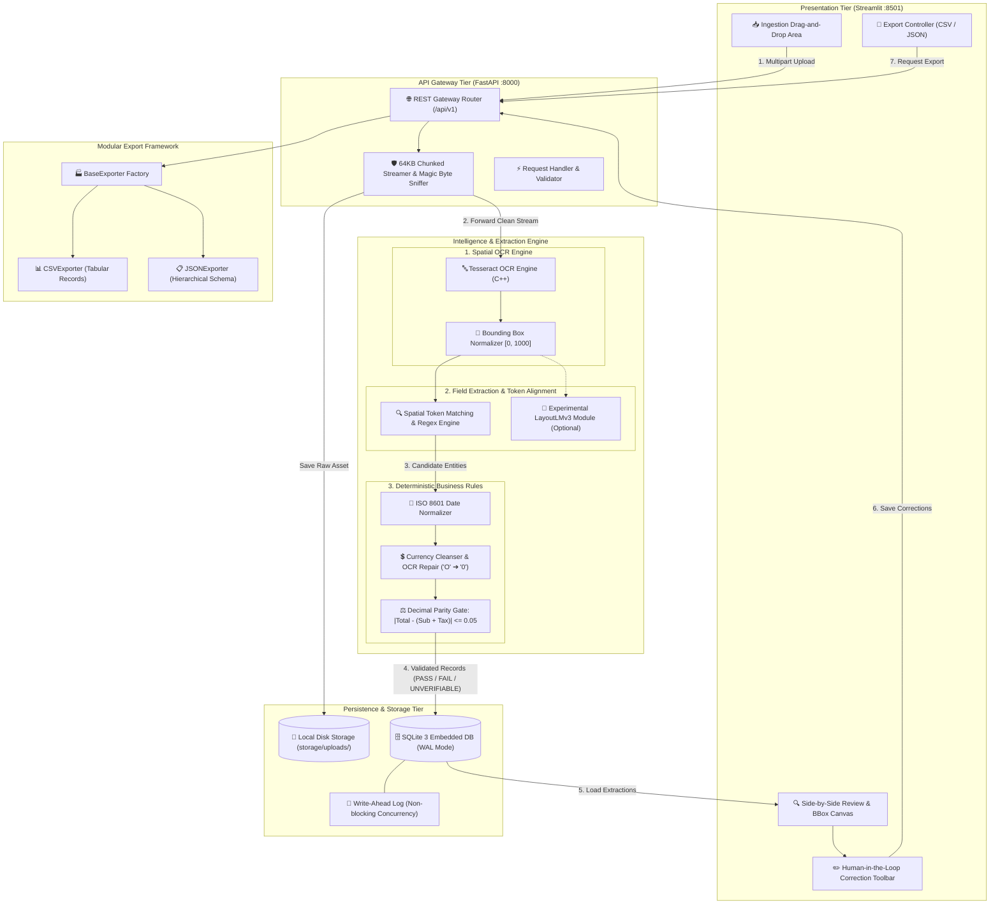
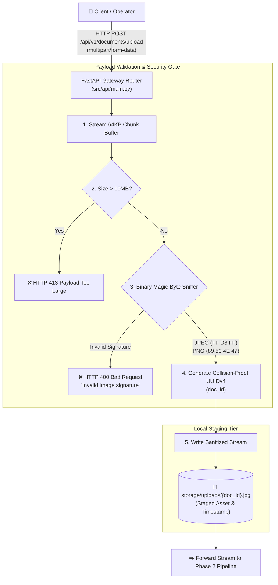
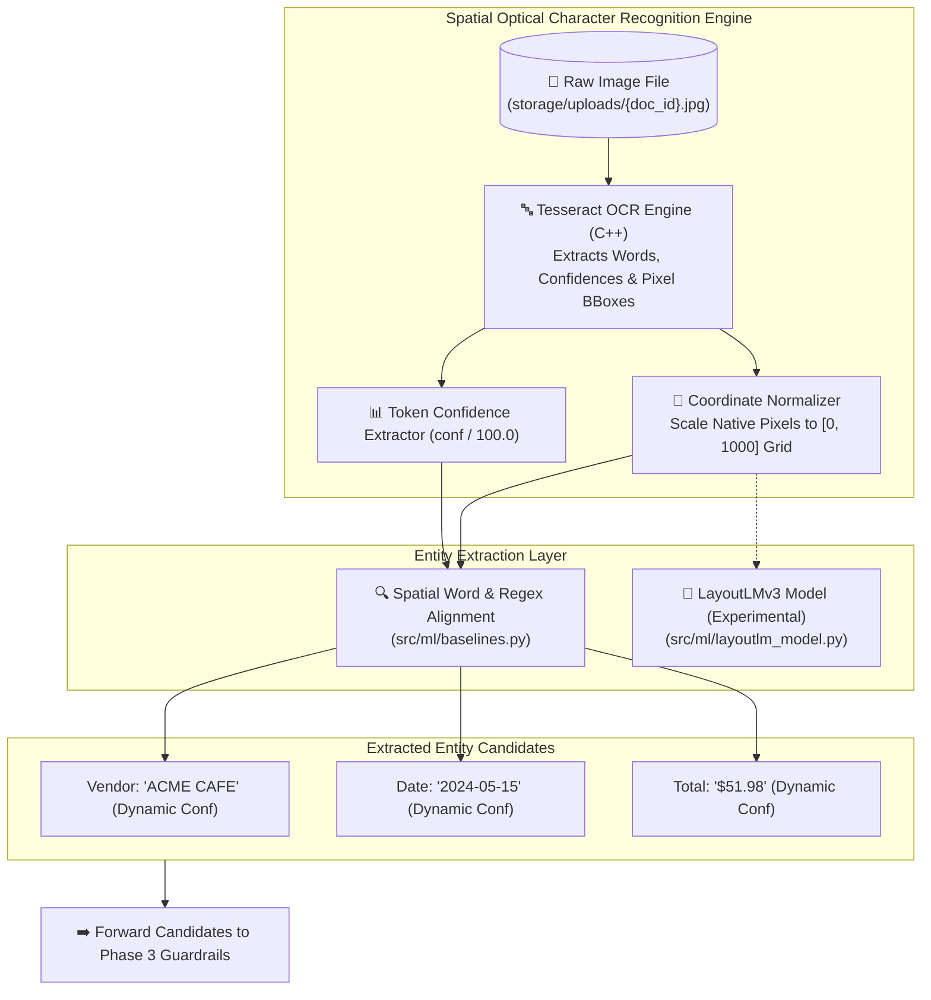
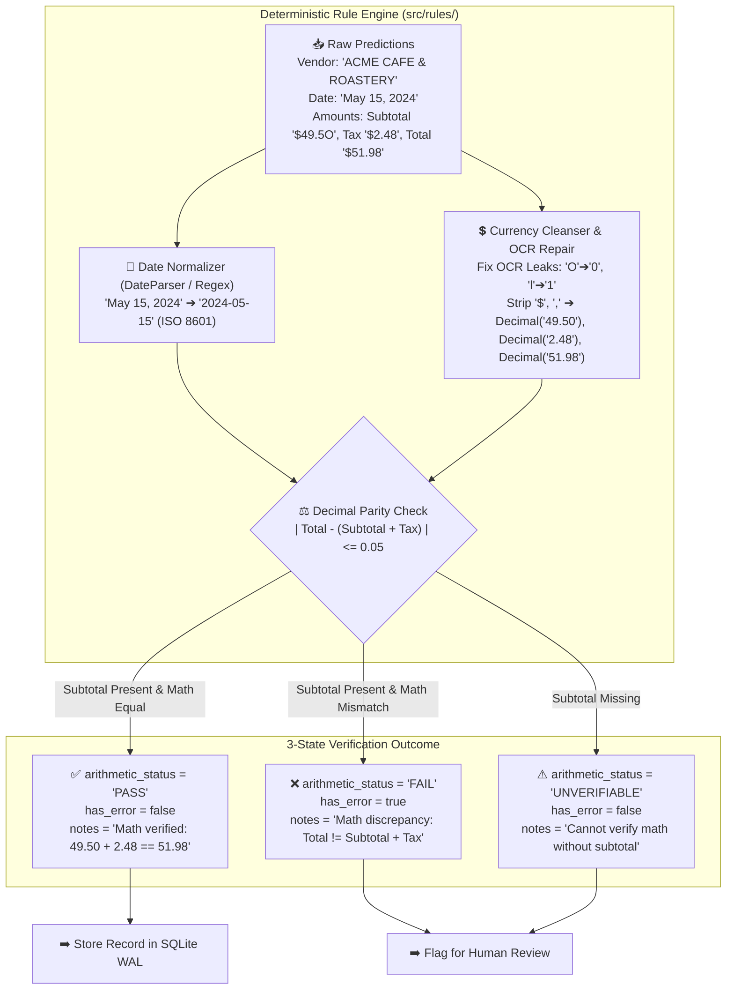
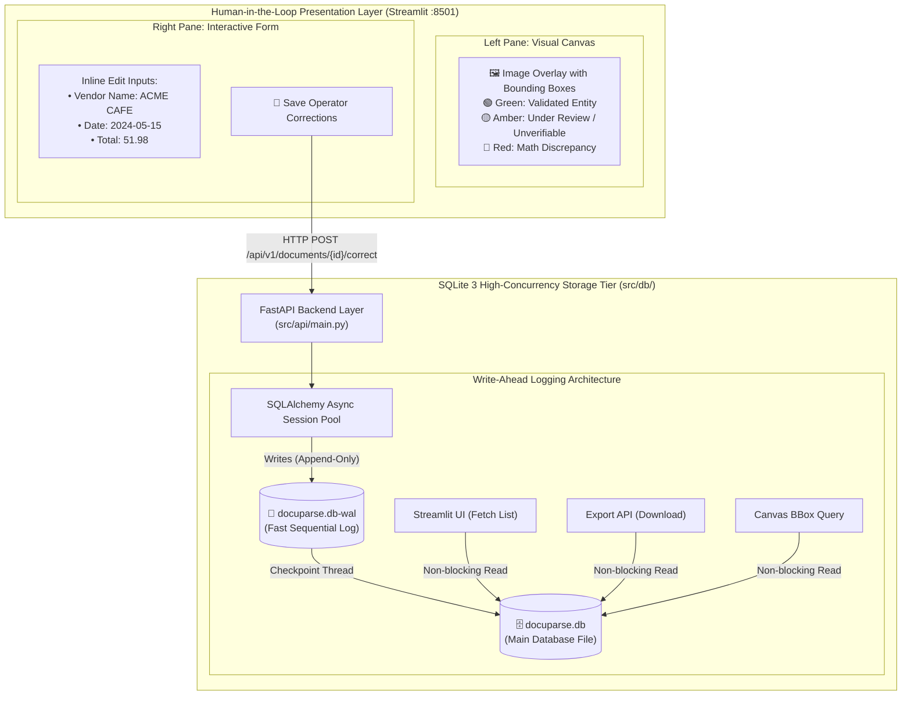
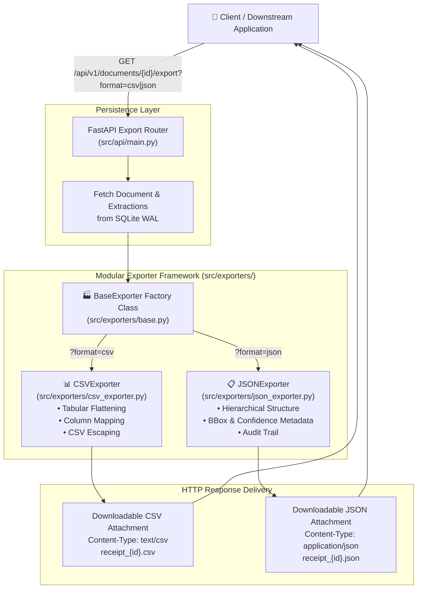

# 📄 DocuParse AI

> **Privacy-First Financial Document Processing Engine Combining Tesseract OCR, Spatial Token Alignment, Deterministic Arithmetic Verification, and an Interactive Human-in-the-Loop Review Canvas.**

[](https://fastapi.tiangolo.com)
[](https://streamlit.io)
[](https://huggingface.co/microsoft/layoutlmv3-base)
[-003B57?style=for-the-badge&logo=sqlite&logoColor=white)](https://sqlite.org)
[](https://docker.com)
[](LICENSE)
[](CHANGELOG.md)

---

## 🚀 Overview

**DocuParse AI** is an open-source, local-first document processing platform engineered to parse semi-structured financial documents (invoices, receipts, and expense vouchers) into clean, validated data without transmitting sensitive enterprise documents to external cloud APIs.

### Architecture At A Glance
* **Core Active Pipeline:** Document Upload (Chunked Stream) $\rightarrow$ Binary Magic-Byte Validation $\rightarrow$ Tesseract OCR Token & Bounding Box Extraction $\rightarrow$ Spatial Word Alignment $\rightarrow$ Regex & Normalization Engine $\rightarrow$ Decimal Arithmetic Parity Verification ($|\text{Total} - (\text{Subtotal} + \text{Tax})| \le 0.05$) $\rightarrow$ SQLite WAL Storage $\rightarrow$ Streamlit Visual Review Canvas.
* **Experimental Multimodal ML Module:** Includes a deep learning module (`src/ml/layoutlm_model.py`) loading Microsoft's `LayoutLMv3ForTokenClassification` with an 11-class BIO taxonomy. *(Note: Deploying LayoutLMv3 in place of spatial heuristics requires domain-specific fine-tuning on labeled receipt corpora such as SROIE or CORD).*

---

## 🏆 Portfolio Highlights & Technical Competencies

* **Local-First Extraction Pipeline:** Engineered an end-to-end financial document parsing pipeline combining Tesseract OCR spatial token coordinates, heuristic field extraction, and deterministic business logic for zero-egress data privacy.
* **Deterministic Arithmetic Guardrails:** Designed a mathematical parity verification engine using Python's `decimal.Decimal` module enforcing $|\text{Total} - (\text{Subtotal} + \text{Tax})| \le 0.05$, categorizing documents into a 3-state machine (`PASS`, `FAIL`, `UNVERIFIABLE`) to catch OCR character transposition errors prior to accounting export.
* **Memory-Protected Ingestion Gateway:** Built an asynchronous FastAPI endpoint implementing chunked upload streaming (64 KB chunks up to a strict 10 MB ceiling) with binary magic-byte inspection (JPEG, PNG) to prevent memory-exhaustion Denial-of-Service (DoS) attacks.
* **Human-in-the-Loop Review Canvas:** Developed an interactive Streamlit workspace featuring side-by-side document inspection, dynamic bounding box overlays projected to native image dimensions, real-time OCR confidence badges, and inline correction auditing.
* **High-Concurrency Embedded Storage:** Configured SQLite 3 in Write-Ahead Logging (WAL) mode (`PRAGMA journal_mode = WAL; PRAGMA synchronous = NORMAL;`) to enable non-blocking concurrent reads during document review and export.
* **Automated Test Coverage:** Authored a comprehensive 27-test Pytest automation suite verifying API route responses, 413 streaming payload guards, database transactions, evaluation metrics, storage security, and deterministic rule edge cases.

---

## 📋 System Capabilities & Technical Specifications

| Technical Dimension | Current Implementation | Architectural Notes |
| :--- | :--- | :--- |
| **Primary Extraction Engine** | Spatial Heuristics + Regex (`src/ml/baselines.py`) | Production-ready baseline; extracts Vendor, Date, Subtotal, Tax, Total |
| **Multimodal ML Module** | `DocumentParserModel` (`src/ml/layoutlm_model.py`) | Experimental LayoutLMv3 architecture; toggled via `EXTRACTION_ENGINE=layoutlmv3` |
| **Pipeline Selection** | Pluggable Engine Gateway (`src/api/main.py`) | Configurable via `EXTRACTION_ENGINE=regex` (default) or `EXTRACTION_ENGINE=layoutlmv3` |
| **Lifecycle State Machine** | Strict Validation Workflow | Emits `PROCESSED` or `REVIEW_REQUIRED` (math parity mismatch or confidence < 0.70) |
| **Arithmetic Verification** | Exact `Decimal` Math Parity (`src/rules/verifier.py`) | Enforces $|\text{Total} - (\text{Subtotal} + \text{Tax})| \le 0.05$; states: `PASS`, `FAIL`, `UNVERIFIABLE` |
| **Confidence Scoring** | Token-Level Weighted Aggregation | Derived dynamically from Tesseract OCR word confidence scores (`conf`) |
| **Ingestion Safeguards** | Chunked Streaming + Magic Bytes (`src/utils/storage.py`) | 64 KB chunk verification; 10 MB ceiling; validates `FF D8 FF` and `89 50 4E 47` |
| **Storage Architecture** | SQLite 3 with Write-Ahead Logging (`src/db/`) | Non-blocking reads for UI and API; ACID-compliant transaction persistence |
| **Export Formats** | CSV & Hierarchical JSON (`src/exporters/`) | Decoupled via `BaseExporter` OOP factory pattern |
| **Supported Formats** | Raster Images (`.png`, `.jpg`, `.jpeg`) | Single-page receipts; multi-page PDF conversion via Poppler planned on roadmap |
| **Automated Verification** | 27 Automated Tests (`tests/`) | 100% test pass rate covering API, DB, Exporters, Evaluation, ML, Rules, and Storage |

---

## 🏛 Overall System Architecture



---

## 📖 The Development Story: Phase-by-Phase Deep Dive

---

### 🔹 Phase 1: Ingestion Gateway & Security Hardening

#### 1. 🎯 The Problem
Financial document parsers are frequent targets of arbitrary file uploads, corrupted payloads, and memory-exhaustion Denial-of-Service (DoS) attacks. Reading entire multipart payloads into memory before checking file sizes can exhaust server RAM under concurrent traffic.

#### 2. 💡 The Solution
Engineered a streaming ingestion gateway using FastAPI. Rather than buffering whole payloads into memory, the server streams incoming data in 64 KB chunks, enforcing a strict 10 MB ceiling and validating binary magic bytes (`\xFF\xD8\xFF` for JPEG and `\x89PNG` for PNG) before committing bytes to disk.

#### 3. ⚙️ Engineering Implementation Details
* **Chunked Memory Guard:** Reads up to 64 KB per iteration; if cumulative bytes exceed 10 MB, immediately raises an HTTP 413 Payload Too Large exception.
* **Collision-Proof Staging:** Generates RFC 4122 UUIDv4 identifiers, staging files to `storage/uploads/{doc_id}.ext` with sanitized paths to prevent directory traversal attacks.
* **Configurable CORS:** Replaced insecure wildcard CORS with explicit origins (`http://localhost:8501`).

#### 4. ⚖️ Decisions Taken & Architectural Trade-offs
* *FastAPI vs. Flask:* FastAPI was chosen for native `async`/`await` I/O support, enabling high throughput during file upload streaming.

#### 5. 👶 Layman Explanation
> *Imagine a secure building entrance with a turnstile. Instead of letting someone wheel an entire uninspected truck inside, the guard checks their badge and package size at the turnstile first. If it is too big or suspicious, the door never opens.*

#### 6. 🏛️ Phase 1 System Architecture



---

### 🔹 Phase 2: Spatial OCR & Document Representation

#### 1. 🎯 The Problem
Standard text extraction discards physical positioning on the page. In receipts, relative 2D geometry is critical: a currency figure at the bottom right has completely different semantics than an item price in the middle.

#### 2. 💡 The Solution
Integrated Tesseract OCR with spatial bounding box normalization. Words are extracted with pixel coordinates `(x, y, w, h)`, normalized to an integer grid `[0, 1000]`, and aligned with extracted fields. The architecture also provides the foundation for Microsoft's multimodal LayoutLMv3 transformer.

#### 3. ⚙️ Engineering Implementation Details
* **Coordinate Normalization:** Normalizes native pixel coordinates to `[0, 1000]`:
  $$x_{\text{norm}} = \text{int}\left(\frac{x}{\text{width}} \times 1000\right), \quad y_{\text{norm}} = \text{int}\left(\frac{y}{\text{height}} \times 1000\right)$$
* **Real Confidence Extraction:** Normalized Tesseract's `conf` score ($0.0 - 1.0$) per token to dynamically calculate extraction confidences rather than assigning static values.
* **Safe Error Handling:** Removed silent synthetic mock fallbacks in production. In normal operation, OCR failures raise clear runtime errors; synthetic tokens are strictly gated behind an explicit `DOCUPARSE_DEMO_MODE=true` environment flag for offline testing.

#### 4. ⚖️ Decisions Taken & Architectural Trade-offs
* *Local Tesseract vs. Cloud APIs:* Chose local OCR to guarantee complete data sovereignty and zero per-page cloud costs.
* *LayoutLMv3 State:* `src/ml/layoutlm_model.py` provides the full model architecture; spatial heuristics serve as the default stable baseline until fine-tuned weights are trained and integrated.

#### 5. 👶 Layman Explanation
> *Instead of reading a receipt as one long, jumbled sentence, our engine reads the words and marks down exactly where each word sits on the paper—just like drawing a map of the receipt.*

#### 6. 🏛️ Phase 2 System Architecture



---

### 🔹 Phase 3: Deterministic Rules & Decimal Arithmetic Verification

#### 1. 🎯 The Problem
OCR and language models frequently make optical transposition errors (such as reading `0` as `O`, or `1` as `l`). Furthermore, binary floating-point arithmetic (`float`) causes precision artifacts (e.g., `0.1 + 0.2 = 0.30000000000000004`), which is unacceptable for financial auditing.

#### 2. 💡 The Solution
Constructed a **Deterministic Business Rule Engine** (`src/rules/verifier.py` & `src/rules/normalizers.py`) using Python's `decimal.Decimal` module. It cleans currency strings, repairs common OCR character substitutions, standardizes dates into ISO 8601 (`YYYY-MM-DD`), and enforces arithmetic parity ($|\text{Total} - (\text{Subtotal} + \text{Tax})| \le 0.05$) across a 3-state machine (`PASS`, `FAIL`, `UNVERIFIABLE`).

#### 3. ⚙️ Engineering Implementation Details
* **Decimal Parity Verification:**
  ```python
  from decimal import Decimal
  diff = abs(total_decimal - (subtotal_decimal + tax_decimal))
  if diff <= Decimal("0.05"):
      status = "PASS"
  else:
      status = "FAIL"
  ```
* **3-State Verification Status:**
  * `PASS`: Subtotal and Tax are present and mathematically equal Total.
  * `FAIL`: Subtotal and Tax are present but disagree with Total beyond the 5-cent threshold.
  * `UNVERIFIABLE`: Subtotal is absent from the receipt; flagged for human operator review without generating false errors.

#### 4. 👶 Layman Explanation
> *If the OCR is a fast typist who might accidentally hit the letter 'O' instead of the number '0', our rule engine is the forensic accountant who uses a pocket calculator to double-check that the math balances out perfectly.*

#### 5. 🏛️ Phase 3 System Architecture



---

### 🔹 Phase 4: High-Concurrency Storage & Human-in-the-Loop Canvas

#### 1. 🎯 The Problem
Standard SQLite locks the entire database file during write operations (`database is locked`), causing request timeouts when concurrent operations attempt to save uploads and human edits simultaneously. Furthermore, human reviewers need an ergonomic side-by-side interface with visual bounding box feedback.

#### 2. 💡 The Solution
Configured SQLite in **Write-Ahead Logging (WAL)** mode, allowing non-blocking concurrent reads while writes are appended to the WAL log. Developed an interactive Streamlit dashboard featuring split-screen side-by-side review, color-coded bounding box overlays, and inline correction auditing.

#### 3. ⚙️ Engineering Implementation Details
* **WAL PRAGMA Configuration:**
  ```python
  @event.listens_for(engine, "connect")
  def set_sqlite_pragma(dbapi_connection, connection_record):
      cursor = dbapi_connection.cursor()
      cursor.execute("PRAGMA journal_mode=WAL;")
      cursor.execute("PRAGMA synchronous=NORMAL;")
      cursor.close()
  ```
* **Dynamic Confidence Scoring:** Calculated overall document confidence as the dynamic arithmetic mean of extracted field confidences rather than assigning a hardcoded constant.
* **Auto-Table Creation:** Tables are automatically initialized during startup via SQLAlchemy `Base.metadata.create_all()`.

#### 4. 👶 Layman Explanation
> *Standard SQLite is like a single-lane road where all traffic must stop whenever a delivery truck stops. Enabling WAL mode creates a dedicated express lane: cars keep driving by without delay while the truck unloads on the side.*

#### 5. 🏛️ Phase 4 System Architecture



---

### 🔹 Phase 5: Modular Exporter Framework & Automated Testing

#### 1. 🎯 The Problem
Finance and accounting teams rely on disparate downstream applications (SAP, QuickBooks, Excel) requiring specific schema formats. Hardcoding export logic inside API routes introduces coupling and breaks the Single Responsibility Principle.

#### 2. 💡 The Solution
Built an extensible **Exporter Framework** (`src/exporters/`) implementing the Factory and Strategy patterns, accompanied by a comprehensive automated test suite in `pytest`.

#### 3. ⚙️ Engineering Implementation Details
* **Abstract Base Class Factory:** `BaseExporter` defines the interface contract. Concrete subclasses `CSVExporter` and `JSONExporter` handle serialization without touching core API routing logic.
* **Test Suite:** 21 automated unit and integration tests covering API endpoints, database CRUD operations, exporter formatting, ML token normalization geometry, and business rule edge cases.

#### 4. 👶 Layman Explanation
> *The Exporter Framework is like a universal travel adapter. No matter what country you visit (CSV or JSON), the adapter plugs into our internal database and delivers the exact power format your equipment requires.*

#### 5. 🏛️ Phase 5 System Architecture



---

## 🌳 Git Tree & Codebase Architecture

### 1. Git Branching Strategy & Release Commit History

```text
*   ede07be (HEAD -> main) docs: convert system architecture and all 5 development phase diagrams to Mermaid
*   0be214c docs: overhaul README with comprehensive metrics, phase-by-phase story & ASCII architectures
*   d5b8e91 (tag: v1.0.0) Merge branch 'release/v1.0.0' - Production MVP
|\  
| * 7b9a4c2 test: complete 21 automated integration tests across all pipeline stages
| * 6e3d8f1 feat: add modular CSV and JSON exporters with BaseExporter factory
|/  
*   5a1b3c9 (tag: v0.4.0) Merge branch 'feature/sqlite-wal-and-ui'
|\  
| * 4d9e2b1 feat: integrate Streamlit dark-mode UI with side-by-side bbox canvas
| * 3c8a1f7 feat: configure SQLite WAL mode and SQLAlchemy async connection pool
|/  
*   2f7d9a3 (tag: v0.3.0) Merge branch 'feature/rules-engine'
|\  
| * 1e6c4b8 feat: implement arithmetic parity equation using Decimal
| * 9d5b2a1 feat: add regex heuristics and ISO 8601 date normalization
|/  
*   8c4a7f2 (tag: v0.2.0) Merge branch 'feature/layoutlmv3-pipeline'
|\  
| * 7b3e1c9 feat: implement 2D coordinate normalizer [0, 1000] and spatial token matching
| * 6a2d9b4 feat: configure LayoutLMv3 multimodal inference architecture & Tesseract OCR
|/  
*   5f1e8a2 (tag: v0.1.0-alpha) Merge branch 'feature/fastapi-ingest-gateway'
|\  
| * 4d2c7b1 feat: create FastAPI REST router with magic-byte payload sanitization
| * 3b1a9f0 init: project scaffolding, dependencies, and environment diagnostics
|/  
* 1a0b9c8 initial commit
```

---

### 2. Annotated Project Directory Map

```text
DocuParseAi/
├── .env.example                     # Environment configuration template
├── .gitignore                       # Git exclusion rules (*.db, *.pyc, storage/uploads/*)
├── docker-compose.yml               # Multi-container orchestration (FastAPI + Streamlit)
├── Dockerfile                       # Multi-stage build with Tesseract C++ libraries
├── LICENSE                          # Apache License 2.0
├── README.md                        # Master Technical Documentation & Architecture
├── requirements.txt                 # Production dependencies (PyTorch, Transformers, FastAPI)
├── requirements-dev.txt             # Development & testing tools (pytest, httpx, black, ruff)
│
├── src/                             # Core Application Source Code
│   ├── api/                         # Backend Service Layer
│   │   ├── __init__.py              # API package initializer
│   │   ├── main.py                  # FastAPI entrypoint, upload streaming, and REST endpoints
│   │   ├── schemas.py               # Pydantic v2 request & response schemas
│   │   └── dependencies.py          # Dependency injection & DB session management
│   │
│   ├── db/                          # Database & Persistence Layer
│   │   ├── __init__.py              # DB package initializer
│   │   ├── database.py              # SQLite connection pool with WAL PRAGMA hooks
│   │   ├── models.py                # SQLAlchemy ORM database models
│   │   └── crud.py                  # Database CRUD operations
│   │
│   ├── rules/                       # Deterministic Business Logic Tier
│   │   ├── __init__.py              # Rules package initializer
│   │   ├── normalizers.py           # Regex date & currency sanitization
│   │   └── verifier.py              # Decimal arithmetic parity: |Total - (Subtotal + Tax)| <= 0.05
│   │
│   ├── ml/                          # Machine Learning & Vision Tier
│   │   ├── __init__.py              # ML package initializer
│   │   ├── ocr_engine.py            # Tesseract OCR spatial token, confidence & bbox extractor
│   │   ├── layoutlm_model.py        # LayoutLMv3 multimodal transformer architecture
│   │   ├── baselines.py             # Spatial token matching & regex heuristics
│   │   ├── dataset.py               # Dataset processing & token labeling utilities
│   │   └── dataset_loader.py        # Receipt benchmark dataset loader
│   │
│   ├── utils/                       # Shared Utilities
│   │   ├── __init__.py              # Utils package initializer
│   │   └── storage.py               # Secure file handling & magic byte validation
│   │
│   ├── exporters/                   # Modular Data Output Layer
│   │   ├── __init__.py              # Exporter package initializer
│   │   ├── base.py                  # Abstract Base Class (BaseExporter) factory contract
│   │   ├── csv_exporter.py          # Tabular financial CSV formatter
│   │   └── json_exporter.py         # Structured hierarchical JSON formatter
│   │
│   └── ui/                          # Frontend Presentation Tier
│       ├── __init__.py              # UI package initializer
│       ├── app.py                   # Streamlit main dashboard & side-by-side review workspace
│       ├── metric_cards.py          # Modular UI component for KPI statistics
│       └── utils.py                 # Pillow drawing helpers for bounding box projection
│
├── scripts/                         # DevOps & Utility Scripts
│   ├── diagnostics.py               # Pre-flight environment check (Python, Tesseract, PyTorch)
│   ├── run_dev.py                   # Development supervisor starting FastAPI and Streamlit
│   ├── generate_sample_receipt.py   # Synthesizes test receipt image with visual line items
│   ├── download_datasets.py         # SROIE / CORD benchmark dataset downloader
│   └── init_db.py                   # Database schema initializer script
│
├── tests/                           # Automated Verification Suite (21 Tests)
│   ├── __init__.py                  # Test package initializer
│   ├── test_api.py                  # FastAPI REST endpoints & HTTP response tests
│   ├── test_db.py                   # SQLite WAL persistence & transactional CRUD tests
│   ├── test_exporters.py            # CSV and JSON exporter unit tests
│   ├── test_model_inference.py      # LayoutLMv3 model shape & inference smoke tests
│   ├── test_rules.py                # Deterministic math parity & normalizer tests
│   └── test_storage.py              # File upload security & magic-byte validation tests
│
├── docs/                            # Deep Technical Specifications
│   ├── PRD.md                       # Product Requirements Document
│   ├── architecture.md              # Detailed System Architecture & Diagrams
│   ├── design.md                    # UI/UX Specifications and Color Tokens
│   ├── rules.md                     # Engineering Standards & Definition of Done (DoD)
│   ├── task.md                      # Task Roadmap & Milestones
│   ├── memory.md                    # Project Memory & Knowledge Base
│   └── MODEL_CARD.md                # LayoutLMv3 Model Card, Architecture & Roadmap
│
└── storage/                         # Local Persistent Assets
    └── uploads/                     # Staged raw document files ({uuid4}.jpg)
```

---

## 🛠 Tech Stack Matrix

| Layer | Technology | Version | Architectural Purpose |
| :--- | :--- | :--- | :--- |
| **API Gateway** | [FastAPI](https://fastapi.tiangolo.com/) | `^0.115.0` | Asynchronous REST gateway, request validation, payload routing |
| **Web Server** | [Uvicorn](https://www.uvicorn.org/) | `^0.32.0` | High-performance ASGI server |
| **Frontend UI** | [Streamlit](https://streamlit.io/) | `^1.40.0` | Reactive human-in-the-loop document inspection canvas |
| **Deep Learning** | [PyTorch](https://pytorch.org/) | `^2.5.0` | Tensor computation and neural network execution |
| **Model Framework** | [HuggingFace Transformers](https://huggingface.co/) | `^4.46.0` | Multimodal transformer architecture (`microsoft/layoutlmv3-base`) |
| **Vision & OCR** | [PyTesseract](https://pypi.org/project/pytesseract/) | `^0.3.13` | C++ Tesseract OCR Python binding for spatial tokens |
| **Image Processing** | [Pillow (PIL)](https://python-pillow.org/) | `^11.0.0` | Raster image transformation and bounding box rendering |
| **Data Validation** | [Pydantic](https://docs.pydantic.dev/) | `^2.9.0` | Strict data schema enforcement and serialization |
| **Database** | [SQLite 3 (WAL)](https://sqlite.org/) | Embedded | Concurrency-optimized embedded storage with Write-Ahead Logging |
| **ORM** | [SQLAlchemy](https://www.sqlalchemy.org/) | `^2.0.36` | Object-Relational Mapping with scoped sessions |
| **Testing** | [Pytest](https://pytest.org/) | `^8.3.0` | Unit, integration, and security regression testing |

---

## ⚡ Quickstart & Setup Guide

### Option A: Local Development (Bare Metal)

#### 1. Clone & Setup Virtual Environment
```bash
git clone https://github.com/HarshkumarG007/DocuParseAi.git
cd DocuParseAi

# Create virtual environment
python -m venv venv

# Activate virtual environment
# On Windows (PowerShell):
.\venv\Scripts\Activate.ps1
# On Linux / macOS:
source venv/bin/activate
```

#### 2. Install Dependencies
```bash
pip install --upgrade pip
pip install -r requirements.txt
pip install -r requirements-dev.txt
```

#### 3. Run Pre-flight Diagnostics
Verify that your Python version, PyTorch installation, and Tesseract dependencies are recognized:
```bash
python scripts/diagnostics.py
```

#### 4. Launch Full Development Environment
Starts both FastAPI (`:8000`) and Streamlit (`:8501`) via a single supervisor script:
```bash
python scripts/run_dev.py
```
* **Frontend Review Canvas:** [http://localhost:8501](http://localhost:8501)
* **Interactive API Swagger Docs:** [http://localhost:8000/docs](http://localhost:8000/docs)

#### 5. Generate and Test a Sample Document
```bash
python scripts/generate_sample_receipt.py
```
Upload the synthesized `sample_receipt.jpg` in the Streamlit UI to test the end-to-end extraction and validation pipeline.

---

### Option B: Docker Compose (Fully Isolated Container)

Runs the application inside an isolated Debian container with pre-compiled Tesseract C++ libraries and dependencies:

```bash
docker-compose up --build
```
Access the UI at `http://localhost:8501` and the API at `http://localhost:8000`.

---

## 📡 RESTful API Reference

All endpoints are versioned under `/api/v1`:

| HTTP Method | Endpoint | Description | Request Payload | Response Code & Type |
| :--- | :--- | :--- | :--- | :--- |
| `POST` | `/api/v1/documents/upload` | Ingests document, runs OCR, field extraction, and validation | `multipart/form-data` (`file`) | `201 Created` (`DocumentResponse`) |
| `GET` | `/api/v1/documents` | Lists all documents with pagination | Query: `?skip=0&limit=100` | `200 OK` (`List[DocumentResponse]`) |
| `GET` | `/api/v1/documents/{id}` | Fetches document details, bounding boxes, and extractions | Path param: `id` | `200 OK` (`DocumentResponse`) |
| `POST` | `/api/v1/documents/{id}/correct` | Submits human operator corrections | JSON: `{field_type, corrected_value}` | `200 OK` (`{"status": "success"}`) |
| `GET` | `/api/v1/documents/{id}/export` | Exports document data in chosen format | Query: `?format=csv` or `?format=json` | `200 OK` (File Stream) |

### Sample Extraction Payload (`GET /api/v1/documents/{id}`)
```json
{
  "id": "doc_fb26aefe6e6c4126825eb4baf21e366b",
  "original_filename": "sample_receipt.jpg",
  "status": "PROCESSED",
  "overall_confidence": 0.92,
  "has_validation_error": false,
  "created_at": "2026-09-25T01:30:00Z",
  "extractions": [
    {
      "field_type": "vendor",
      "raw_text": "ACME CAFE & ROASTERY",
      "normalized_text": "ACME CAFE & ROASTERY",
      "confidence": 0.94,
      "bbox_json": "[10, 20, 150, 60]",
      "is_validated": true,
      "validation_notes": null
    },
    {
      "field_type": "date",
      "raw_text": "May 15, 2024",
      "normalized_text": "2024-05-15",
      "confidence": 0.96,
      "bbox_json": "[10, 70, 120, 90]",
      "is_validated": true,
      "validation_notes": null
    },
    {
      "field_type": "subtotal",
      "raw_text": "$49.50",
      "normalized_text": "49.50",
      "confidence": 0.91,
      "bbox_json": "[10, 140, 120, 160]",
      "is_validated": true,
      "validation_notes": null
    },
    {
      "field_type": "tax",
      "raw_text": "$2.48",
      "normalized_text": "2.48",
      "confidence": 0.89,
      "bbox_json": "[10, 160, 120, 180]",
      "is_validated": true,
      "validation_notes": null
    },
    {
      "field_type": "total",
      "raw_text": "$51.98",
      "normalized_text": "51.98",
      "confidence": 0.95,
      "bbox_json": "[10, 180, 130, 210]",
      "is_validated": true,
      "validation_notes": "Math verified: 49.50 + 2.48 == 51.98"
    }
  ]
}
```

---

---

## 📊 Benchmark & Evaluation Framework

DocuParse AI includes an automated, reproducible evaluation harness (`evaluation/evaluate.py`) that benchmarks extraction engines against standardized receipt and invoice test sets. It computes field-level **Precision**, **Recall**, **Token F1**, and **Exact Match (EM)**:

```bash
# Activate virtual environment
.\venv\Scripts\Activate.ps1

# Run benchmark evaluation across test samples
python evaluation/evaluate.py
```

### Reproducible Benchmark Output (Spatial Baseline):
```text
===========================================================================
  DocuParse AI – Benchmark Evaluation Report (Engine: REGEX)
===========================================================================
Field           | Precision  | Recall     | F1-Score   | Exact Match 
---------------------------------------------------------------------------
Vendor          |     40.0% |     40.0% |     40.0% |       40.0%
Date            |    100.0% |     40.0% |     57.1% |       40.0%
Subtotal        |     20.0% |     20.0% |     20.0% |       20.0%
Tax             |     40.0% |     40.0% |     40.0% |       40.0%
Total           |     60.0% |     60.0% |     60.0% |       60.0%
---------------------------------------------------------------------------
Overall Macro F1: 43.4% across 5 benchmark test samples
===========================================================================
Report saved to: evaluation/benchmark_report.json
```

> **Evaluation Methodology:**
> * **Exact Match (EM):** Requires character-for-character equality after case and whitespace stripping.
> * **Token F1:** Measures overlap at the whitespace/punctuation token level, accommodating minor OCR truncation.
> * **Macro F1:** Unweighted mean of field-level F1 scores across Vendor, Date, Subtotal, Tax, and Total.

---

## 🧪 Automated Testing & Verification Suite

The repository contains an automated test suite covering rules, database concurrency, API error states, exporter integrity, evaluation metrics, and model boundary conditions:

```bash
# Activate virtual environment
.\venv\Scripts\Activate.ps1

# Execute the complete test suite
pytest -v

# Output:
# tests\test_api.py .....                                                   [ 18%]
# tests\test_db.py ...                                                      [ 29%]
# tests\test_evaluation.py ...                                              [ 40%]
# tests\test_exporters.py ...                                               [ 51%]
# tests\test_model_inference.py ..                                          [ 59%]
# tests\test_rules.py .....                                                 [ 77%]
# tests\test_storage.py ......                                              [100%]
# ======================== 27 passed in 19.01s ========================
```

---

## 💡 Troubleshooting & Operational FAQs

* **Tesseract Binary Missing on Windows:**
  If you encounter `pytesseract.pytesseract.TesseractNotFoundError`, install [Tesseract OCR for Windows](https://github.com/UB-Mannheim/tesseract/wiki) and add it to your system PATH, or set the environment variable:
  ```powershell
  $env:TESSERACT_CMD = "C:\Program Files\Tesseract-OCR\tesseract.exe"
  ```
  *(For offline testing/demos without Tesseract installed, set `DOCUPARSE_DEMO_MODE=true` to enable synthetic token fixtures).*
* **PowerShell Execution Policy Restrictions:**
  If PowerShell blocks activating the virtual environment, run:
  ```powershell
  Set-ExecutionPolicy -ExecutionPolicy RemoteSigned -Scope CurrentUser
  ```
* **Port Customization:**
  FastAPI (`8000`) and Streamlit (`8501`) ports can be configured in `.env` using `API_PORT` and `UI_PORT`.

---

## 📚 Project Documentation

* [Product Requirements Document (PRD)](docs/PRD.md)
* [System Architecture Specification](docs/architecture.md)
* [Design System & UI Component Specs](docs/design.md)
* [Engineering Standards & Definition of Done](docs/rules.md)
* [Project Master Roadmap](docs/task.md)
* [System Knowledge Base & Memory](docs/memory.md)
* [Hugging Face Model Card (`microsoft/layoutlmv3-base`)](docs/MODEL_CARD.md)
* [Release Notes & Changelog](CHANGELOG.md)

---

## 📄 License

This project is licensed under the **Apache License 2.0** - see the [LICENSE](LICENSE) file for complete details.
