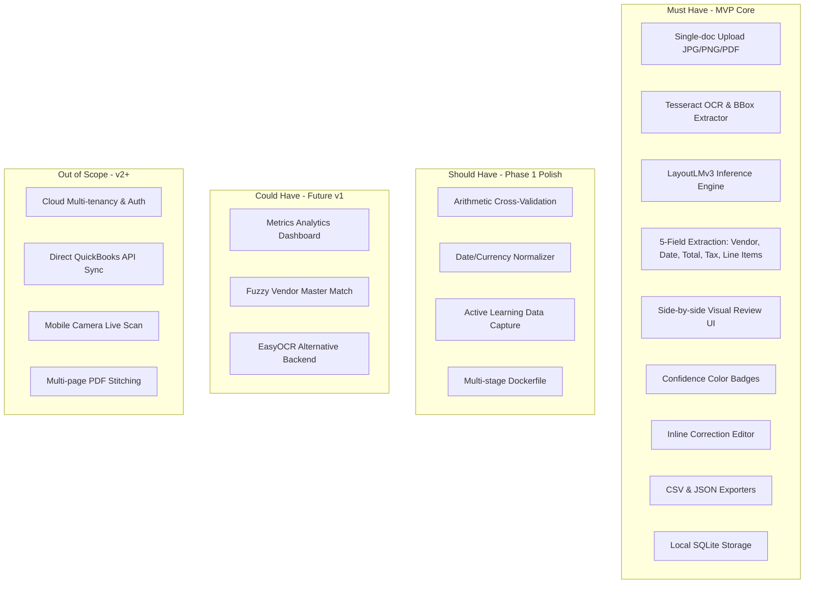
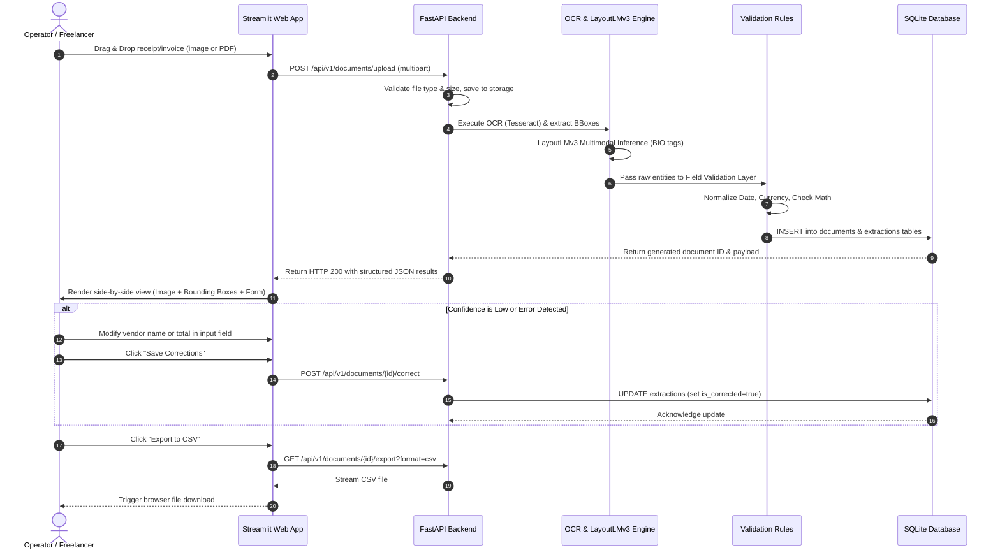

# Product Requirements Document (PRD)

## Document Details
- **Project Name:** DocuParse AI — Intelligent Document Understanding for Financial Records
- **Version:** 1.0.0-MVP
- **Status:** Approved / Specification Baseline
- **Date:** 2026-09-24
- **Author/Architect:** Senior Full-Stack Developer & AI Systems Architect

---

## 1. Product Overview

### What the Product Is
DocuParse AI is an end-to-end, privacy-preserving document intelligence platform engineered to ingest semi-structured financial documents (invoices, receipts, and purchase orders) and extract structured, validated data using multimodal deep learning (LayoutLMv3) paired with deterministic post-processing rules.

### What It Does
1. Accepts document uploads in image formats (PNG, JPEG) and digitized or scanned PDFs.
2. Extracts textual tokens, spatial bounding boxes, and visual layouts via an optical character recognition (OCR) pipeline (Tesseract OCR).
3. Classifies token semantics and predicts critical entity boundaries using a multimodal transformer (`microsoft/layoutlmv3-base`) fine-tuned on financial document datasets.
4. Executes deterministic business validation algorithms (e.g., date normalization, currency parsing, mathematical consistency checks between line items, subtotal, tax, and total).
5. Presents a high-precision, side-by-side human-in-the-loop review interface showing visual bounding box overlays, confidence score indicators, and inline correction editors.
6. Exports validated extractions into standard financial formats (CSV and structured JSON).

### Why It Exists
Manual transcription of receipts and invoices into accounting ledgers, spreadsheets, or enterprise resource planning (ERP) software is an inefficient bottleneck. It requires 5 to 10 minutes per document, introduces high human error rates (transposition errors, missed taxes), and delays cash flow visibility. Existing commercial cloud OCR platforms (e.g., AWS Textract, Google Document AI, Azure Form Recognizer) impose recurring pay-per-page API fees ($30–$50/month minimum commitments) and require uploading sensitive financial receipts to public cloud servers, violating data residency preferences for privacy-conscious freelancers, small business owners, and accounting professionals.

### Primary Value Proposition
- **High-Accuracy Multimodal Extraction:** Leverages text + spatial coordinates + visual features to surpass brittle regex/OCR heuristics, targeting an entity F1 score > 0.75.
- **Local-First & Zero Cloud Lock-in:** Runs entirely on local consumer hardware (8GB GPU or standard CPU), eliminating SaaS subscription fees and preserving confidential client financials.
- **Human-in-the-Loop Velocity:** Transforms 10 minutes of manual data entry into a 10-second visual verification and one-click export workflow.
- **Deterministic Post-Validation:** Automatically flags math discrepancies (Subtotal + Tax != Total) and formats dates/currencies consistently.

### MVP Scope & Objectives
The MVP demonstrates a complete, reliable, production-tested proof-of-work:
- Ingestion of 3 document categories: Receipts, Invoices, Purchase Orders.
- Extraction of 5 core fields: Vendor Name, Document Date, Total Amount, Tax Amount, and Line Items (as structured JSON array).
- Visual UI for uploading, reviewing bounding boxes, correcting low-confidence fields, and exporting to CSV/JSON.
- Execution under a local FastAPI + Streamlit architecture.

---

## 2. Problem Statement

### The Problem
Financial recordkeeping requires manual keying of vendor names, transaction dates, itemized charges, sales taxes, and total amounts into financial software. This manual workflow suffers from:
1. **Time Consumption:** Manual entry takes 5–10 minutes per document, consuming 15–20 hours a month for typical small businesses.
2. **High Error Rates:** 2–5% typing errors result in reconciliation discrepancies, tax filing errors, or duplicate payments.
3. **Data Privacy & Compliance Concerns:** Sending sensitive bank-linked receipts to commercial cloud OCR APIs exposes proprietary commercial data.
4. **Layout Fragility:** Traditional template-matching or regex-based open-source tools break whenever vendor templates vary by even a few pixels.

### Target Users Experiencing This Problem
- **Small Business Owners & Sole Proprietors:** Drowning in paper/digital receipts without dedicated bookkeeping staff.
- **Freelancers & Contractors:** Needing rapid expense aggregation for client billing and tax deduction proof.
- **Bookkeeping & Accounting Students / Junior Accountants:** Managing receipt ingestion and reconciliation across varied formats.

### Current Alternatives and Why They Fail
| Approach | Mechanism | Failure Mode / Deficiency |
| :--- | :--- | :--- |
| **Manual Keyboarding** | Human manual transcription | Slow, expensive, prone to fatigue and transposition errors. |
| **Traditional OCR + Regex** | Tesseract + regex search patterns | Fails on layout variations (e.g., "Total" keyword located distant from amount, or stacked tables). F1 typically < 0.45. |
| **Commercial Cloud APIs** | AWS Textract, Google Document AI | Expensive recurring per-page pricing ($1.50–$3.00/1000 pages + base tier), requires continuous internet, data privacy liability. |
| **Generic LLMs (Zero-Shot)** | Uploading images to GPT-4o / Claude Vision | Slow (8–15 seconds per call), costly API tokens, high hallucination risk on exact digits, vendor privacy violation. |

### Improvement DocuParse AI Delivers
DocuParse AI provides a specialized multimodal transformer running locally, processing documents in < 3 seconds with zero external API costs, providing 100% data confidentiality, and embedding human validation safeguards before records are finalized.

---

## 3. Goals & Non-Goals

### Measurable MVP Goals
- **G-1 (Extraction Quality):** Achieve an entity-level F1 score $\ge 0.75$ across vendor name, date, total, and tax on held-out test splits of standard financial benchmarks (SROIE/CORD).
- **G-2 (Processing Latency):** Complete end-to-end processing (image ingest $\rightarrow$ OCR $\rightarrow$ LayoutLMv3 inference $\rightarrow$ post-validation) in $< 3.0$ seconds per document on consumer GPU (e.g., RTX 3060/4060) and $< 8.0$ seconds on modern 8-core CPU.
- **G-3 (Error Correction Rate):** Achieve a $30\%+$ automatic correction or normalization rate of raw OCR errors via the deterministic field validation layer.
- **G-4 (System Stability):** Ingest and parse 10 consecutive diverse test invoices/receipts with zero unhandled exceptions or crashes.
- **G-5 (User Ergonomics):** Allow an operator to review, edit, and export a parsed receipt in under 30 seconds using the side-by-side interactive UI.

### Non-Goals (Explicitly Out of MVP Scope)
- **NG-1 (No Cloud Multi-Tenancy):** No multi-tenant user authentication, subscription billing, or multi-organization workspaces in MVP.
- **NG-2 (No Complex Handwritten Scans):** MVP does not target unconstrained cursive handwriting; targets typed/printed text and semi-formal printed receipts/invoices.
- **NG-3 (No Direct ERP Cloud Sync):** No direct REST integration with QuickBooks Online, Xero, or SAP in MVP (CSV and JSON export only).
- **NG-4 (No Multi-Page PDF Stitching):** MVP processes single-page invoices/receipts or the first page of multi-page documents. Multi-page cross-page line-item aggregation is deferred to v2.
- **NG-5 (No Continuous Background Training):** Training is done offline during development; the MVP runtime environment performs inference and data collection only.

---

## 4. Target Users & Personas

### Persona 1: The Freelance Digital Consultant (Primary)
- **Demographics *(Assumption)*:** Age 26–42; solo operator; generates 30–80 expense receipts/invoices monthly.
- **Technical Proficiency:** Moderate; comfortable downloading and launching desktop software or Docker, uses Excel/CSV.
- **Motivations:** Wants to claim all eligible tax deductions without spending entire Sunday afternoons typing receipts into spreadsheets.
- **Frustrations:** Dislikes subscription fatigue ($20/month software for 40 receipts is unviable); fears sensitive invoice data leaking to external LLM servers.
- **Goals:** Batch export clean CSV files matching tax deduction categories with verifiable receipt links.

### Persona 2: The Small Retail / Service Business Owner (Secondary)
- **Demographics *(Assumption)*:** Age 35–55; manages 3–8 employees; receives dozens of vendor delivery slips, invoices, and material receipts weekly.
- **Technical Proficiency:** Low to average; expects intuitive graphical controls, clear red/yellow/green verification tags, and simple buttons.
- **Motivations:** Needs accurate cash flow tracking and faster verification of supplier invoices against bank debits.
- **Frustrations:** Supplier invoices have widely divergent layouts; traditional OCR misses tax lines or confuses date formats (DD/MM vs MM/DD).
- **Goals:** Quick verification of line items and total amounts, followed by instant CSV export for their external accountant.

---

## 5. User Stories

| ID | User Persona | User Story | Acceptance Criteria | Priority |
| :--- | :--- | :--- | :--- | :--- |
| **US-01** | Small Business Owner | *As an operator*, I want to drag and drop an image or PDF of an invoice into the application, *so that* the system automatically parses its content without manual entry. | Accepts `.png`, `.jpg`, `.jpeg`, `.pdf`; displays upload progress and preview within 1 second. | **Must Have** |
| **US-02** | Freelancer | *As an operator*, I want to view extracted fields (vendor, date, total, tax) side-by-side with the original document image, *so that* I can visually verify extraction fidelity. | Document image displayed on left with bounding box overlays; editable extracted fields presented on right. | **Must Have** |
| **US-03** | Small Business Owner | *As an operator*, I want to see confidence scores and color-coded status badges for each field, *so that* I immediately know which fields require my review. | Green ($\ge 0.85$), Amber ($0.60–0.84$), Red ($< 0.60$ or validation failure) badges rendered per field. | **Must Have** |
| **US-04** | Junior Accountant | *As an operator*, I want to click and edit any incorrectly extracted field directly, *so that* the final recorded dataset is 100% accurate. | Edited fields are highlighted, marked as user-validated, and persisted to the local SQLite database. | **Must Have** |
| **US-05** | Freelancer | *As an operator*, I want to export parsed and verified documents into CSV or JSON format, *so that* I can import them into Excel or my accounting spreadsheet. | "Export to CSV" and "Export to JSON" buttons generate downloadable files with correct headers and normalized amounts. | **Must Have** |
| **US-06** | Junior Accountant | *As an operator*, I want the system to check if Subtotal + Tax = Total, *so that* arithmetic inconsistencies are flagged before I finalize the record. | Mathematical validation rule flags mismatches $> \$0.02$ as an arithmetic alert in the UI. | **Should Have** |
| **US-07** | Freelancer | *As an operator*, I want the system to store corrected values, *so that* corrections can later be used to retrain and improve the model. | User edits are stored alongside initial predictions in SQLite with an `is_corrected = TRUE` flag. | **Should Have** |
| **US-08** | Business Owner | *As an operator*, I want a dashboard showing total documents processed and average extraction accuracy, *so that* I can assess processing volume. | Streamlit metrics card displays document count, average confidence, and flagged count. | **Could Have** |

---

## 6. Core MVP Features & Scope Prioritization

### MoSCoW Feature Matrix

### Detailed Feature Specifications (Must-Have)

#### Feature 1: Document Ingestion & Optical Character Recognition
- **Purpose:** Ingest incoming files and generate tokenized text with precise 2D bounding boxes normalized to $[0, 1000]$.
- **Behavior:** Receives file, converts PDF to 300 DPI image (if applicable), resizes to max dimension 1024px while maintaining aspect ratio, executes Tesseract OCR with `image_to_data` output, and produces word-level bounding boxes.
- **Acceptance Criteria:** Handles clean and scanned inputs up to 10MB; emits structured word tokens with bounding boxes in $< 1.2$s.

#### Feature 2: Multimodal Transformer Extraction (LayoutLMv3)
- **Purpose:** Jointly model visual document image, text tokens, and 2D spatial layout to label tokens with BIO tags (`B-VENDOR`, `I-VENDOR`, `B-DATE`, `I-DATE`, `B-TOTAL`, `I-TOTAL`, `B-TAX`, `I-TAX`, `B-ITEM`, `I-ITEM`).
- **Behavior:** Feeds image tensor and normalized bbox coordinates into LayoutLMv3-base; extracts token spans, aggregates multi-token entities, and calculates softmax confidence scores per field.
- **Acceptance Criteria:** Outputs predicted entities with confidence scores $\in [0.0, 1.0]$ in $< 1.5$s on GPU / $< 5.0$s on CPU.

#### Feature 3: Deterministic Field Validation & Normalization
- **Purpose:** Correct OCR noise and enforce schema integrity.
- **Behavior:** 
  - Standardizes dates to `YYYY-MM-DD` via `dateparser`.
  - Normalizes amounts to decimal `float` (removes `$`, `€`, commas, handles OCR `O` vs `0` errors).
  - Flags arithmetic warnings if $|\text{Total} - (\text{Subtotal} + \text{Tax})| > 0.05$.
- **Acceptance Criteria:** Invalid dates and malformed currency tokens are flagged; clean outputs conform to typed Pydantic models.

#### Feature 4: Side-by-Side Review & Correction Interface
- **Purpose:** Provide an intuitive human-in-the-loop workflow.
- **Behavior:** Renders document image on the left with interactive or highlighted bounding boxes. Renders editable input fields on the right. Highlights fields with green/amber/red borders depending on confidence and validation status.
- **Acceptance Criteria:** Clicking "Save & Confirm" persists user edits to SQLite and marks document status as `VERIFIED`.

#### Feature 5: Structured Data Exporter
- **Purpose:** Output finalized financial records into downstream workflows.
- **Behavior:** Generates RFC 4180-compliant CSV files containing standard headers: `document_id`, `filename`, `processed_date`, `vendor_name`, `document_date`, `tax_amount`, `total_amount`, `line_items_json`, `status`. Also provides full JSON payload download.
- **Acceptance Criteria:** CSV opens cleanly in Microsoft Excel / Google Sheets without formatting corruption.

---

## 7. User Flows

### Primary Flow: Upload, Process, Review, and Export

---

## 8. Functional Requirements

- **FR-1:** The system shall accept image files in `.png`, `.jpg`, `.jpeg`, and single-page `.pdf` formats up to 10MB in size.
- **FR-2:** The system shall reject unsupported file types or files exceeding size limits with clear, human-readable error messages.
- **FR-3:** The OCR engine shall generate word-level bounding boxes with coordinates $[x_0, y_0, x_1, y_1]$ normalized to an integer scale of $0$ to $1000$.
- **FR-4:** The ML inference pipeline shall output predicted text, field class, bounding box, and extraction confidence score for:
  - Vendor / Company Name
  - Document / Invoice Date
  - Total Amount
  - Tax / VAT Amount
  - Line Items (Item Description + Item Amount)
- **FR-5:** The validation layer shall parse raw date strings into standard ISO 8601 (`YYYY-MM-DD`). If parsing fails, it shall flag the field with `date_parsing_error`.
- **FR-6:** The validation layer shall strip currency symbols (`$`, `£`, `€`, `¥`), parse string amounts into IEEE 754 floating-point decimals, and flag negative or non-numeric values.
- **FR-7:** The validation layer shall calculate mathematical parity: if $\text{Subtotal}$ and $\text{Tax}$ exist, verify whether $|\text{Total} - (\text{Subtotal} + \text{Tax})| \le 0.05$. If false, trigger an `arithmetic_discrepancy` alert.
- **FR-8:** The UI shall display bounding boxes corresponding to extracted fields overlaid onto the document image.
- **FR-9:** The UI shall allow the user to modify any extracted value and save the changes.
- **FR-10:** The persistence layer shall record both original model predictions and user-corrected values to enable future active learning.
- **FR-11:** The export module shall generate downloadable CSV and JSON files formatted with appropriate MIME types (`text/csv`, `application/json`).

---

## 9. Non-Functional Requirements

### Performance
- **NFR-P1 (Latency):** Total inference and processing turnaround time shall be $< 3.0$ seconds on GPU hardware (NVIDIA RTX 3060/4060 or equivalent) and $< 8.0$ seconds on 8-core CPU for an image of dimensions up to $2048 \times 2048$.
- **NFR-P2 (Memory Footprint):** GPU VRAM allocation during fine-tuning shall not exceed 7.5GB (fitting comfortably in 8GB VRAM) via gradient checkpointing and mixed-precision FP16. Inference runtime shall consume $\le 2.0$GB VRAM / $\le 3.5$GB System RAM.
- **NFR-P3 (Throughput):** Local FastAPI endpoint shall sustain $\ge 10$ concurrent upload/review requests without socket drops or worker thread exhaustion.

### Security & Privacy
- **NFR-S1 (Local Data Residency):** No document, image, or parsed metadata shall be transmitted to external third-party cloud APIs. All models and OCR binaries run entirely on localhost.
- **NFR-S2 (Path Traversal Protection):** Uploaded filenames must be sanitized using UUID generation or strict alphanumeric regex; directory traversal sequences (`../`, `..\\`) must be stripped immediately.
- **NFR-S3 (Payload Safety):** File uploads must be checked for true magic byte signatures (MIME sniffing) rather than trusting client-provided file extensions.
- **NFR-S4 (Secret Management):** No plaintext secrets, tokens, or credentials shall be committed to version control; all runtime configuration must be loaded via `.env`.

### Reliability & Availability
- **NFR-R1 (Graceful Degradation):** If LayoutLMv3 fails or encounters an unhandled tensor exception, the system shall fall back to raw OCR text display with an error banner, allowing manual user entry rather than crashing.
- **NFR-R2 (Database Durability):** SQLite database shall operate in Write-Ahead Logging (`PRAGMA journal_mode=WAL;`) to prevent locking conflicts between concurrent FastAPI writes and Streamlit reads.

### Maintainability & Usability
- **NFR-M1 (Code Quality):** Codebase must maintain strict typing via Python type annotations, Pydantic v2 schemas, and pass `ruff` / `black` lint checks.
- **NFR-M2 (Test Coverage):** Core business logic, validation rules, and API endpoints shall have $\ge 80\%$ automated unit and integration test coverage.
- **NFR-U1 (Visual Ergonomics):** UI shall maintain WCAG 2.2 AA contrast ratios ($> 4.5:1$ for text) and clearly differentiate bounding box colors across distinct entity types.

---

## 10. Success Criteria

| Milestone / Metric | Baseline (Regex/OCR) | Target MVP Goal | Method of Verification |
| :--- | :--- | :--- | :--- |
| **Field Extraction F1** | $0.45$ (Tesseract + Regex) | **$\ge 0.75$** | Evaluated on held-out 300 test receipts (SROIE/CORD). |
| **Processing Latency** | $1.2$s (OCR only) | **$< 3.0$s (Full ML Pipeline)** | Average latency across 50 inference runs on GPU. |
| **Field Error Correction** | $0\%$ | **$\ge 30\%$ corrected** | Percentage of raw OCR formatting/date errors resolved by validation rules. |
| **Crash Rate** | N/A | **$0$ crashes on 10 diverse receipts** | End-to-end integration test parsing 10 complex invoices. |
| **Operator Time per Doc** | $300–600$s (Manual) | **$< 30$s (Review & Export)** | User acceptance test timing standard invoice ingest to CSV download. |

---

## 11. Open Questions & Assumptions

### Assumptions (Explicitly Labeled)
1. **[Assumption-01] Local Environment Execution:** We assume the operator has Python 3.9–3.11 installed along with local Tesseract OCR binaries, or will run the application via our provided multi-stage Docker container.
2. **[Assumption-02] Single-Page Financial Focus:** We assume standard receipts and retail invoices are single-page documents. Multi-page document merging is deferred.
3. **[Assumption-03] Language Focus:** We assume documents are predominantly printed in English or Latin script matching the SROIE and CORD training distributions. Non-Latin scripts (e.g., Cyrillic, Chinese, Arabic) will require separate OCR language packs.
4. **[Assumption-04] GPU Availability for Training:** Fine-tuning requires an NVIDIA GPU with at least 8GB VRAM (or a cloud Google Colab/Kaggle notebook). Inference can run on either GPU or modern CPU.

### Decisions Requiring Confirmation
- **[Decision-01] Frontend Architecture:** The execution blueprint specifies Streamlit for rapid prototyping and human-in-the-loop review. If the user eventually requires a standalone commercial SaaS SPA, Next.js + React would be substituted in Phase 2. *Decision for MVP: Streamlit confirmed per blueprint.*
- **[Decision-02] OCR Engine:** Tesseract OCR is selected for zero-cost local deployment. Should EasyOCR or PaddleOCR be evaluated as an alternative backend if Tesseract accuracy on noisy mobile camera photos is insufficient? *Decision for MVP: Tesseract baseline with modular OCR wrapper.*
