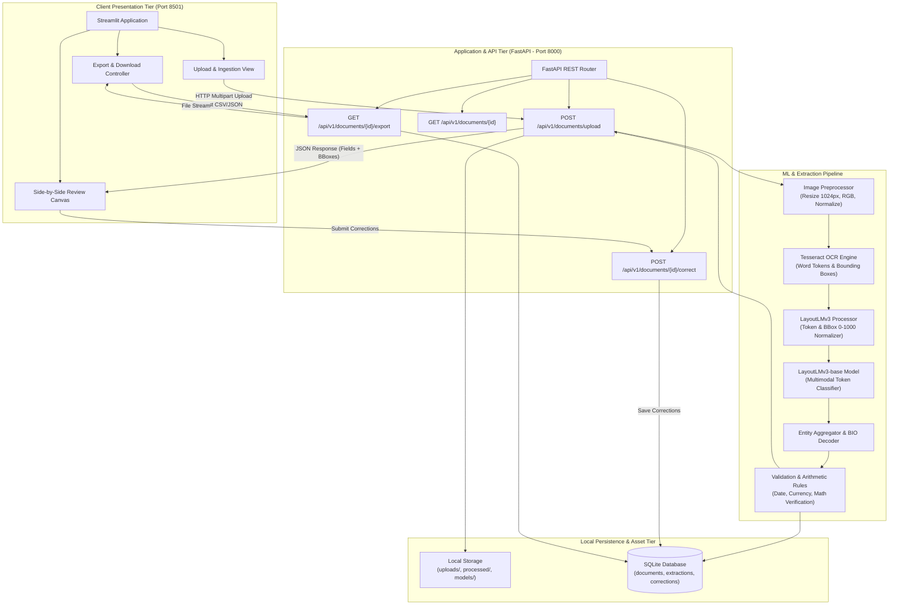
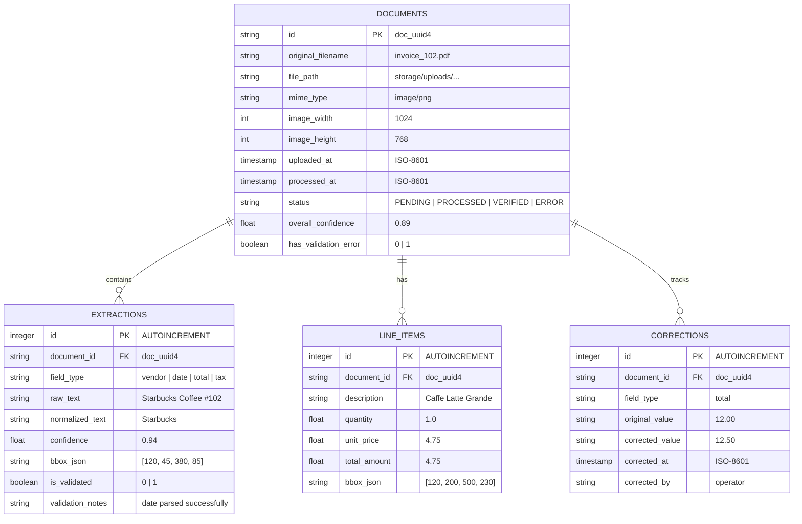
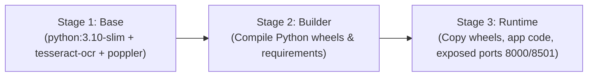

# System Architecture Document

## Document Details
- **Project Name:** DocuParse AI — Intelligent Document Understanding for Financial Records
- **Version:** 1.0.0-MVP
- **Status:** Approved / Specification Baseline
- **Date:** 2026-09-24
- **Architect:** Senior Full-Stack Developer & AI Systems Architect

---

## 1. Architecture Overview

DocuParse AI is structured as a modular, local-first service oriented around privacy, low latency, and deterministic reliability. The system decouples interactive visual exploration from heavy computational inference through a clean client-server architecture:

```text
Operator / User
      │
      ▼
Frontend (Streamlit UI on port 8501)
      │  (HTTP / Multipart REST Calls)
      ▼
API Gateway & Backend (FastAPI on port 8000)
      │
      ├── File Storage & Sanitization (Local Filesystem)
      │
      ├── OCR Pipeline (Tesseract OCR / PyTesseract)
      │
      ├── ML Inference Engine (LayoutLMv3 Multimodal Transformer)
      │
      ├── Validation & Normalization Layer (Pydantic + Business Logic)
      │
      ▼
Persistence Layer (SQLite Database with WAL Mode)
```

1. **Frontend (Presentation Layer):** A Streamlit application providing a reactive user interface for file drag-and-drop, bounding box rendering onto document canvases, interactive confidence badges, and data export.
2. **Backend (API Layer):** A high-performance FastAPI service handling payload validation, file integrity verification, asynchronous request routing, and error boundaries.
3. **ML Inference Pipeline (Deep Learning Engine):** A two-stage pipeline combining spatial OCR token extraction (Tesseract) with a multimodal transformer (`microsoft/layoutlmv3-base`) that jointly analyzes image pixels, token strings, and normalized 2D bounding boxes.
4. **Validation Layer (Deterministic Guardrails):** A rules engine applying date normalization, monetary value formatting, and mathematical cross-checks (subtotal + tax = total).
5. **Persistence Layer (Data Tier):** An embedded SQLite database configured in Write-Ahead Logging (WAL) mode for storing document metadata, extraction outputs, and human corrections for active learning.

---

## 2. Architecture Diagram



---

## 3. Complete Technology Stack

| Component / Layer | Technology | Version | Purpose & Architectural Justification | Status |
| :--- | :--- | :--- | :--- | :--- |
| **Language** | Python | 3.10+ | Standard language for PyTorch, ML tooling, and rapid backend service development. | Confirmed |
| **Backend Framework** | FastAPI | ^0.110.0 | High-throughput asynchronous REST API framework with native Pydantic v2 data validation and auto-generated OpenAPI documentation. | Confirmed |
| **ASGI Server** | Uvicorn | ^0.28.0 | Lightweight, lightning-fast ASGI web server for running FastAPI asynchronously. | Confirmed |
| **Frontend Framework** | Streamlit | ^1.32.0 | Rapid, Python-native reactive web interface enabling side-by-side bounding box visualization and interactive data tables without frontend build tool complexity. | Confirmed |
| **Frontend Styling** | Vanilla CSS + Streamlit Custom Components | Custom CSS | Injected modern dark/light CSS variables and custom card styles to deliver a professional, non-generic look. | Confirmed |
| **OCR Engine** | Tesseract OCR + PyTesseract | ^0.3.10 | Mature, battle-tested open-source OCR engine providing word-level bounding boxes and text coordinates without external API fees. | Confirmed |
| **Deep Learning Framework** | PyTorch | ^2.2.0 | Primary tensor computation framework supporting GPU acceleration (CUDA 11.8/12.1) and CPU fallback. | Confirmed |
| **Transformers & Tokenizers** | Hugging Face Transformers | ^4.38.0 | Provides pre-trained multimodal `LayoutLMv3-base` model architectures, processors, and tokenizers. | Confirmed |
| **Memory Optimization** | Hugging Face Accelerate | ^0.27.0 | Enables mixed-precision FP16 training and gradient checkpointing to fine-tune on 8GB consumer GPUs. | Confirmed |
| **Image Processing** | Pillow (PIL) & OpenCV-Python | Pillow ^10.2, OpenCV ^4.9 | Handles image decoding, DPI scaling, aspect-ratio-preserving resizing, and bounding-box drawing onto canvases. | Confirmed |
| **Data Validation & Parsing** | Pydantic v2 & `dateparser` | Pydantic ^2.6, dateparser ^1.2 | Strongly typed schema validation and multilingual date normalization. | Confirmed |
| **Database** | SQLite 3 | Embedded | Zero-configuration, serverless, self-contained SQL engine running in Write-Ahead Logging (WAL) mode for concurrency. | Confirmed |
| **Database ORM / Access** | SQLAlchemy Core / SQLite3 Native | ^2.0 | Type-safe SQL query generation and schema migrations without excessive ORM overhead. | Confirmed |
| **Export Formats** | Pandas & Python `csv` | Pandas ^2.2 | Dataframe aggregation and RFC 4180-compliant CSV and JSON file serialization. | Confirmed |
| **Testing Suite** | Pytest & HTTPX | Pytest ^8.0, HTTPX ^0.27 | Comprehensive unit testing for validation rules, API endpoints, and ML inference pipeline mocking. | Confirmed |
| **Containerization** | Docker (Multi-stage) | Multi-stage | Packages Python, Debian base, Tesseract C++ binaries, and models into an isolated, reproducible container. | Confirmed |
| **Version Control & MLOps** | Git + DVC (Data Version Control) | DVC ^3.40 | Tracks datasets (SROIE, CORD) and model weight artifacts (`.bin` / `.safetensors`) without repo bloat. | Confirmed |
| **Cloud Integrations** | None (Zero external APIs) | N/A | Strictly local-first architecture for privacy and zero recurring infrastructure costs. | Confirmed |

---

## 4. Application Flow

1. **Client Ingestion:**
   - The user opens `http://localhost:8501` and navigates to the Upload tab.
   - The user selects or drags a document (PNG/JPG/PDF).
   - Streamlit sends a `POST` request with `multipart/form-data` to FastAPI (`POST /api/v1/documents/upload`).

2. **Validation & Storage:**
   - FastAPI inspects the HTTP stream, verifies the MIME signature (magic bytes), and generates a unique document UUID (`doc_{uuid4}`).
   - The file is persisted under `storage/uploads/{doc_id}.ext`. If the upload is a PDF, the first page is rendered to a 300 DPI PNG image.

3. **OCR Processing:**
   - The image is loaded via Pillow, resized to a maximum dimension of 1024px while preserving aspect ratio, and handed to Tesseract OCR.
   - Tesseract extracts word tokens, confidence ratings, and pixel coordinates $[x_0, y_0, x_1, y_1]$.
   - Coordinates are normalized to the integer bounding box range $[0, 1000]$ relative to image width and height.

4. **LayoutLMv3 Inference:**
   - The image tensor, normalized bounding boxes, and word tokens are processed by `LayoutLMv3Processor`.
   - The model generates logits for each token across entity labels (`B-VENDOR`, `I-VENDOR`, `B-DATE`, `I-DATE`, `B-TOTAL`, `I-TOTAL`, `B-TAX`, `I-TAX`, `B-ITEM`, `I-ITEM`, `O`).
   - Softmax probabilities are calculated to produce token-level confidence scores.

5. **Entity Aggregation & Validation:**
   - Contiguous BIO tokens are aggregated into entity spans.
   - Entity text and bounding boxes are evaluated by the deterministic validation engine:
     - Dates are parsed into `YYYY-MM-DD`.
     - Totals and taxes are converted into numeric floats.
     - Line items are assembled into a structured JSON array.
     - Arithmetic verification checks: $|\text{Total} - (\text{Subtotal} + \text{Tax})| \le 0.05$.

6. **Persistence & Presentation:**
   - Document metadata and extracted fields are written to SQLite.
   - Structured JSON is returned to Streamlit.
   - Streamlit renders the image on the left with color-coded bounding boxes and editable fields with confidence badges on the right.

7. **Human-in-the-Loop Correction & Export:**
   - The user inspects fields; if an amount was misread, the user edits the input field and clicks "Save Corrections".
   - Streamlit posts the corrected payload to `POST /api/v1/documents/{doc_id}/correct`.
   - The user clicks "Export to CSV" or "Export to JSON" to download the verified financial data.

---

## 5. Data Flow & Transformation Lifecycle

```text
[Raw Image / PDF File]
       │
       ▼ (Resize to max 1024px, maintain aspect ratio)
[Standardized RGB Image Tensor (3, 1024, W')]
       │
       ▼ (Tesseract OCR Engine)
[Word Tokens: List[str]] + [Raw Pixel BBoxes: List[Tuple[int, int, int, int]]]
       │
       ▼ (Normalize to [0, 1000] scale: x * 1000 / W, y * 1000 / H)
[Normalized BBoxes: List[List[int]]]
       │
       ▼ (LayoutLMv3 Multimodal Inference)
[Token BIO Predictions: List[str]] + [Softmax Probabilities: List[float]]
       │
       ▼ (Entity Aggregation: Merge B- and I- tokens)
[Raw Entities: Dict[field_type, {text, bbox, raw_confidence}]]
       │
       ▼ (Deterministic Rules Layer: Dateparser, Currency Regex, Math Checker)
[Validated Structured Record: Pydantic Schema]
       │
       ├────────────────────────┬────────────────────────┐
       ▼                        ▼                        ▼
[SQLite DB Records]    [Streamlit UI Display]     [CSV / JSON Exports]
```

---

## 6. Database Architecture

The system uses an embedded SQLite database located at `storage/db/docuparse.db`.

### SQLite Configuration
- `PRAGMA journal_mode = WAL;` (Enables concurrent reads during writes)
- `PRAGMA synchronous = NORMAL;` (Maximizes write performance while maintaining durability)
- `PRAGMA foreign_keys = ON;` (Enforces referential integrity)

### Entity-Relationship Diagram



### Table Schemas & Indexes

#### 1. Table `documents`
- `id` (TEXT PRIMARY KEY): Unique identifier prefixed with `doc_`.
- `original_filename` (TEXT NOT NULL): Sanitized filename.
- `file_path` (TEXT NOT NULL): Absolute or relative filesystem location.
- `mime_type` (TEXT NOT NULL): E.g., `image/jpeg`, `image/png`, `application/pdf`.
- `image_width` (INTEGER NOT NULL), `image_height` (INTEGER NOT NULL).
- `uploaded_at` (TIMESTAMP DEFAULT CURRENT_TIMESTAMP).
- `processed_at` (TIMESTAMP NULL).
- `status` (TEXT DEFAULT 'PENDING'): Processing lifecycle status.
- `overall_confidence` (REAL NULL): Mean confidence across predicted fields.
- `has_validation_error` (BOOLEAN DEFAULT 0).
- **Index:** `idx_documents_status` on (`status`), `idx_documents_uploaded` on (`uploaded_at`).

#### 2. Table `extractions`
- `id` (INTEGER PRIMARY KEY AUTOINCREMENT).
- `document_id` (TEXT NOT NULL, FOREIGN KEY REFERENCES `documents(id)` ON DELETE CASCADE).
- `field_type` (TEXT NOT NULL): `vendor_name`, `document_date`, `total_amount`, `tax_amount`.
- `raw_text` (TEXT NOT NULL).
- `normalized_text` (TEXT NULL).
- `confidence` (REAL NOT NULL).
- `bbox_json` (TEXT NOT NULL): JSON serialized array `[x0, y0, x1, y1]`.
- `is_validated` (BOOLEAN DEFAULT 0).
- `validation_notes` (TEXT NULL).
- **Index:** `idx_extractions_doc_id` on (`document_id`).

#### 3. Table `line_items`
- `id` (INTEGER PRIMARY KEY AUTOINCREMENT).
- `document_id` (TEXT NOT NULL, FOREIGN KEY REFERENCES `documents(id)` ON DELETE CASCADE).
- `description` (TEXT NOT NULL).
- `quantity` (REAL DEFAULT 1.0).
- `unit_price` (REAL NULL).
- `total_amount` (REAL NOT NULL).
- `bbox_json` (TEXT NULL).
- **Index:** `idx_line_items_doc_id` on (`document_id`).

#### 4. Table `corrections` (Active Learning Log)
- `id` (INTEGER PRIMARY KEY AUTOINCREMENT).
- `document_id` (TEXT NOT NULL, FOREIGN KEY REFERENCES `documents(id)`).
- `field_type` (TEXT NOT NULL).
- `original_value` (TEXT NOT NULL).
- `corrected_value` (TEXT NOT NULL).
- `corrected_at` (TIMESTAMP DEFAULT CURRENT_TIMESTAMP).
- `corrected_by` (TEXT DEFAULT 'operator').
- **Index:** `idx_corrections_doc_id` on (`document_id`).

---

## 7. Authentication & Authorization Boundaries

### MVP Security Posture
DocuParse AI MVP is architected as a **local-first, single-operator desktop tool**.
- **Authentication:** For local single-node execution, authentication is disabled by default to eliminate friction for local desktop operators.
- **Authorization:** File access is restricted strictly to the application's root `storage/` directory. All database queries are parameterized to prevent SQL injection.
- **V1 Extension Hook:** The FastAPI router includes an optional API key dependency (`X-API-Key` header verification) controlled via an environment variable `API_KEY_AUTH_ENABLED=false`. When deployed to a shared server or network preview, setting this to `true` enforces key validation.

---

## 8. Concrete Proposed Folder Structure

```text
DocuParseAi/
├── docs/                               # Project source of truth
│   ├── PRD.md                          # Product requirements
│   ├── architecture.md                 # System architecture (this document)
│   ├── rules.md                        # Development & AI guidelines
│   ├── design.md                       # Design system & visual specs
│   ├── task.md                         # Task roadmap & execution breakdown
│   └── memory.md                       # Project history & handoff state
├── src/                                # Core application source code
│   ├── __init__.py
│   ├── api/                            # FastAPI backend services
│   │   ├── __init__.py
│   │   ├── main.py                     # FastAPI entry point & CORS configuration
│   │   ├── routes.py                   # REST endpoints (upload, inspect, correct, export)
│   │   ├── schemas.py                  # Pydantic request/response models
│   │   └── dependencies.py             # Dependency injection (DB session, config)
│   ├── ml/                             # Machine learning & OCR subsystems
│   │   ├── __init__.py
│   │   ├── ocr_engine.py               # Tesseract wrapper & bounding box generator
│   │   ├── layoutlm_model.py           # LayoutLMv3 wrapper & inference runner
│   │   ├── dataset_loader.py           # SROIE / CORD parser & BIO tag aligner
│   │   ├── train.py                    # Fine-tuning script with Accelerate FP16
│   │   └── baselines.py                # Regex & CRF baseline benchmarks
│   ├── rules/                          # Deterministic validation layer
│   │   ├── __init__.py
│   │   ├── normalizers.py              # Date, currency, string normalizers
│   │   └── verifier.py                 # Mathematical parity verifier (Subtotal+Tax=Total)
│   ├── db/                             # Database persistence
│   │   ├── __init__.py
│   │   ├── database.py                 # SQLite connection manager & WAL config
│   │   ├── models.py                   # Database table definitions
│   │   └── crud.py                     # CRUD operations (insert doc, save correction)
│   ├── exporters/                      # Export formatting
│   │   ├── __init__.py
│   │   ├── csv_exporter.py             # RFC-compliant CSV generator
│   │   └── json_exporter.py            # Financial schema JSON generator
│   └── ui/                             # Streamlit frontend presentation
│       ├── __init__.py
│       ├── app.py                      # Main Streamlit dashboard & tab controller
│       ├── styles.py                   # Injected Vanilla CSS styling & themes
│       ├── components/                 # Reusable UI widgets
│       │   ├── __init__.py
│       │   ├── canvas_overlay.py       # Image + bounding box overlay renderer
│       │   ├── field_editor.py         # Side-by-side editable field form
│       │   └── metric_cards.py         # Confidence & summary metrics cards
│       └── utils.py                    # UI state helpers & API client calls
├── storage/                            # Persistent runtime storage (gitignored)
│   ├── uploads/                        # Raw uploaded images and PDFs
│   ├── processed/                      # Resized/annotated inspection images
│   ├── models/                         # Checkpoints & model weights
│   └── db/                             # SQLite database file
├── data/                               # Dataset directory (gitignored)
│   ├── raw/                            # SROIE, CORD, FUNSD raw downloads
│   └── processed/                      # Pre-tokenized train/val/test splits
├── tests/                              # Automated test suite
│   ├── __init__.py
│   ├── conftest.py                     # Pytest fixtures and mock images
│   ├── test_api.py                     # FastAPI endpoint tests
│   ├── test_ocr.py                     # Tesseract extraction tests
│   ├── test_rules.py                   # Date, currency, and arithmetic tests
│   └── test_model_inference.py         # Mock LayoutLMv3 output shape tests
├── scripts/                            # Operational & helper scripts
│   ├── download_datasets.py            # Automated dataset retrieval
│   └── run_dev.py                      # Starts both FastAPI & Streamlit concurrently
├── Dockerfile                          # Multi-stage Docker build
├── docker-compose.yml                  # Multi-container orchestration
├── requirements.txt                    # Production Python dependencies
├── requirements-dev.txt                # Development & testing tools (pytest, ruff, black)
├── .env.example                        # Template environment variables
├── .gitignore                          # Standard git ignore definitions
└── README.md                           # Project quickstart and overview
```

---

## 9. Component Responsibilities

| Subsystem | Primary Module | Responsibilities | Dependencies |
| :--- | :--- | :--- | :--- |
| **API Server** | `src/api/` | Handles HTTP routing, input sanitization, file size verification, calls ML pipeline, and returns JSON. | FastAPI, Pydantic |
| **OCR Service** | `src/ml/ocr_engine.py` | Converts images/PDFs into word tokens with coordinates $[x_0, y_0, x_1, y_1]$ normalized to $[0, 1000]$. | Tesseract, PyTesseract, Pillow |
| **Model Service** | `src/ml/layoutlm_model.py` | Loads fine-tuned weights, executes forward pass, computes entity probabilities, and returns BIO entity spans. | PyTorch, Transformers, LayoutLMv3 |
| **Rules Engine** | `src/rules/` | Deterministically cleans dates, formats money, and checks if subtotal + tax = total. | `dateparser`, Python standard library |
| **Persistence** | `src/db/` | Manages SQLite connection, executes schema setup, stores raw/corrected fields in WAL mode. | SQLite3, SQLAlchemy Core |
| **Export Service** | `src/exporters/` | Serializes verified database records into downloadable CSV/JSON payloads. | Pandas |
| **Frontend UI** | `src/ui/` | Renders interactive web UI, overlays bounding boxes onto document canvas, and captures human edits. | Streamlit, Pillow |

---

## 10. External Services & System Binaries

DocuParse AI deliberately relies on **zero commercial cloud APIs**. However, it requires specific local system binaries and pre-trained weights:
1. **Tesseract OCR (C++ System Binary):**
   - Debian/Ubuntu: `apt-get install tesseract-ocr libtesseract-dev`
   - Windows: Tesseract v5.x binary installer (path configured via `TESSERACT_CMD` environment variable).
2. **Pre-Trained Transformer Weights:**
   - Base model: `microsoft/layoutlmv3-base` (downloaded once from Hugging Face Hub during setup and cached locally in `storage/models/`).
3. **Ghostscript / Poppler (PDF Utilities):**
   - `pdf2image` relies on `pdftoppm` (included in `poppler-utils`) to render uploaded PDF pages to 300 DPI images.

---

## 11. Environment Configuration

All runtime options are managed via standard environment variables loaded from a `.env` file. Safe placeholder template:

```env
# Application Host & Port Settings
FASTAPI_HOST=0.0.0.0
FASTAPI_PORT=8000
STREAMLIT_PORT=8501
ENVIRONMENT=development
LOG_LEVEL=INFO

# Storage & Database Paths
STORAGE_DIR=./storage
DATABASE_PATH=./storage/db/docuparse.db
UPLOAD_DIR=./storage/uploads
PROCESSED_DIR=./storage/processed

# System Binaries Paths (Update for Windows if not in PATH)
TESSERACT_CMD=
POPPLER_PATH=

# ML Model Configuration
MODEL_NAME_OR_PATH=microsoft/layoutlmv3-base
FINE_TUNED_CHECKPOINT=./storage/models/layoutlmv3_finetuned
DEVICE=cuda
MAX_IMAGE_DIM=1024
INFERENCE_BATCH_SIZE=1

# Optional Security / Auth (Default disabled for local MVP)
API_KEY_AUTH_ENABLED=false
DOCUPARSE_API_KEY=
```

---

## 12. Deployment Architecture

### 1. Development Mode (Local Machine)
- Execution: Python virtual environment (`venv`).
- Command: `python scripts/run_dev.py` launches FastAPI on `localhost:8000` and Streamlit on `localhost:8501`.
- Live reload enabled for rapid iteration.

### 2. Preview / Demonstration Mode (Local or Ngrok)
- Exposes Streamlit UI locally at `http://localhost:8501`.
- Optional tunnel via Ngrok for external stakeholder preview:
  `ngrok http 8501`

### 3. Production / Containerized Mode (Docker Multi-Stage)
A multi-stage Docker build ensures a lightweight image containing all C++ binaries and Python wheels:



- Multi-stage build isolates build dependencies from the final minimal runtime image.
- Both FastAPI and Streamlit are supervised or orchestrated via `docker-compose.yml`.

---

## 13. Scalability Considerations (Future v1/v2 Roadmap)

While the MVP is intentionally single-node and local-first, the architecture is designed with modular boundaries that support future horizontal scaling:

1. **Inference Decoupling:**
   - The ML inference worker can be extracted from FastAPI into a dedicated Celery/Redis queue or Ray Serve cluster.
2. **Model Acceleration:**
   - Export LayoutLMv3 to **ONNX Runtime** with INT8 quantization, reducing inference latency by $2\times$ and allowing CPU inference in $< 2.0$ seconds.
3. **Storage Transition:**
   - The local `storage/uploads/` path can be swapped with an S3-compatible object store (MinIO or AWS S3) via an abstract `StorageProvider` interface.
4. **Database Migration:**
   - SQLite can be transitioned to PostgreSQL with zero schema refactoring since table definitions use standard SQL types.

---

## 14. Architectural Risks & Mitigations

| Risk | Impact | Likelihood | Mitigation Strategy |
| :--- | :--- | :--- | :--- |
| **GPU Out-of-Memory (OOM) during Fine-Tuning** | High | Medium | Enable gradient checkpointing (`model.gradient_checkpointing_enable()`), use FP16 mixed precision with Hugging Face Accelerate, set batch size to 2 with 8 gradient accumulation steps. |
| **Poor OCR Quality on Low-Res Scans** | Medium | High | Apply OpenCV pre-processing: automatic deskewing, Otsu thresholding, and contrast stretching prior to Tesseract ingestion. |
| **Tesseract Binary Missing on Host OS** | High | Medium | Provide comprehensive Dockerfile packaging all binaries, and include an OS-specific pre-flight diagnostic check in `run_dev.py`. |
| **SQLite Concurrency Lock on Simultaneous Operations** | Medium | Low | Explicitly set `PRAGMA journal_mode = WAL;` and configure connection pooling with a 30-second busy timeout. |
| **High Inference Latency on Pure CPU** | Medium | Medium | Resize image max dimension to 1024px; implement model caching in server memory so model weights are loaded once at startup rather than per request. |
